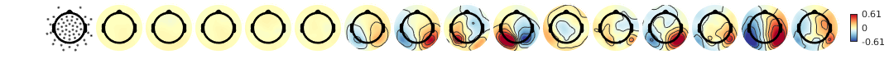
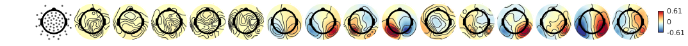

For a [detailed description go here](http://benediktehinger.de/blog/science/eeg-contours-in-multiple-topoplots/)

In the above blog post I argue that this:

is better than this:

This repo has the corresponding scripts to it.
